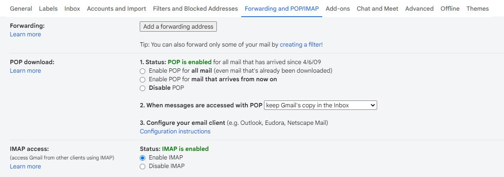
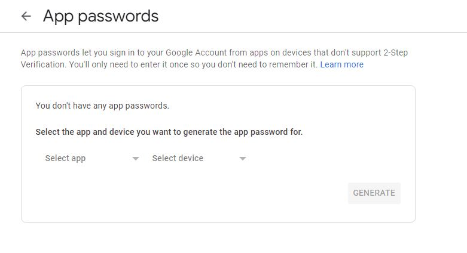

# mail-reader
Python script to read directly from gmail using imaplib

# Pre-requisites

Make sure to follow these steps

- Enable IMAP in your gmail settings


- Generate password in App passwords under google settings

Choose app as 'other' and give it any name\
This generates a 16 character password 


- Update ```credentials.yml ```

## Steps to run the project

To run the project
```bash
  python server.py 
```
Open ```localhost:80``` to view the interface
